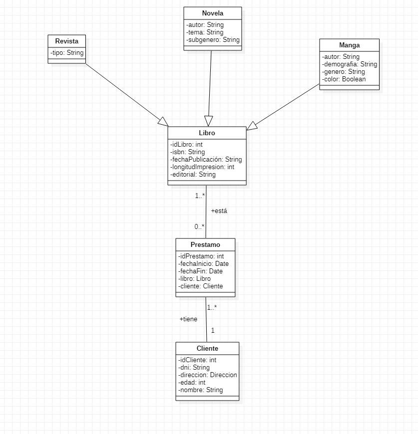

# 
 Proyecto UD3 HIBERNATE 

### 
 Proyecto para el módulo de Acceso a Datos del curso 2º de DAM 

## Supuesto:
##### El proyecto consiste en una aplicación java que permita la gestión de una biblioteca. La biblioteca tiene una colección de libros, que se prestaran a los clientes. Los clientes tienen que estar dados de alta en el sistema antes de poder llevarse libros prestados.
- Novelas
- Mangas
- Revistas

##### Los campos comunes de los libros son:
- ID: Identificador único del libro.
- ISBN: Código normalizado internacional para libros.
- Titulo: Título del libro.
- Fecha de publicación: Fecha de publicación del libro.
- Editorial: Editorial del libro.
- Longitud de impresión: Longitud de páginas del libro.
- Lista de préstamos: Guarda todos los préstamos en los que fue incluido el libro.

### Los libros se pueden dividir en tres tipos:
#### Novelas:
Sus campos unicos son:
- Autor: Autor de la novela.
- Tema: Tema de la novela.
- Subgénero: Subgénero de la novela.

#### Mangas:
Sus campos unicos son:
- Autor: Autor del manga.
- Demografía: Demografía del manga.
- Género: Género del manga.
- Color: Indica si el manga está a color o no.

#### Revistas:
Su campo único es:
- Tipo: Tipo de la revista.

##### Para los clientes guardaremos los siguientes datos:
- ID: Identificador único del cliente.
- Nombre: Nombre del cliente.
- Apellido: Apellido del cliente.
- DNI: DNI del cliente.
- Dirección: Dirección del cliente.
- Edad: Edad del cliente.
- Lista de préstamos: Guarda todos los préstamos del cliente.

##### Para la dirección usaremos un objeto incrustado con los siguientes campos:
- Calle: Calle de la dirección.
- Número: Número de la dirección.
- País: País de la dirección.
- Ciudad: Ciudad de la dirección.
- Provincia: Provincia de la dirección.
- Código postal: Código postal de la dirección.

### Para los préstamos guardaremos los siguientes datos:
- ID: Identificador único del préstamo.
- Fecha de inicio: Fecha de inicio del préstamo.
- Fecha de límite: Fecha límite del préstamo.
- Fecha de devolución: Fecha de devolución del préstamo.
- Devolución: Indica si el préstamo ha sido devuelto.
- Lista de libros: Guarda todos los libros que se prestaron.
- Cliente: Cliente al que se le prestaron los libros.

## Diagrama de clases y CFM:

## Propuestas de mejora:
- Añadir interfaz gráfica.
- Controlar la entrada de datos para que corresponda con el tipo de dato que se espera. (Por ejemplo, no se puede introducir una edad negativa, o no se puede introducir una fecha de nacimiento mayor a la actual etc...)
- Añadir una opción para ampliar automáticamente la fecha máxima de entrega de un préstamo.

    

